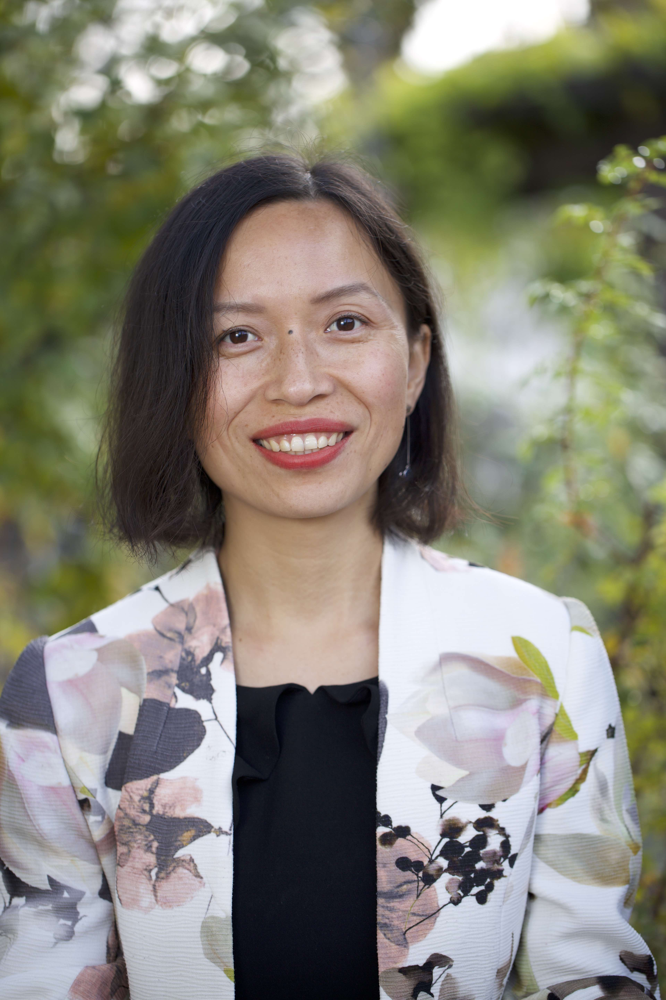
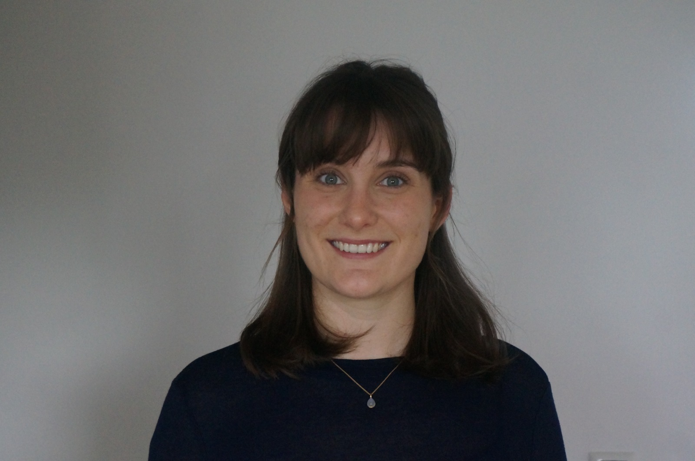

## Dr. Pengjuan Zu 祖鹏娟(PI)

## Roberto H. Rebollo (PhD student)

## Dr. Yan Yang (Postdoc)

My research focuses on the chemical ecology of plant-insect interactions. By deciphering the chemical communication substances between plants at different altitudes and different functional groups of insects in various habitats, understand the chemical communication mechanism between plants and insects, to achieve the purpose of biodiversity conservation and restoration practices.

## Flurina Zahn (Bachelor student)

-----
Past Students

Dominic Stalder (Master student, 2022)

